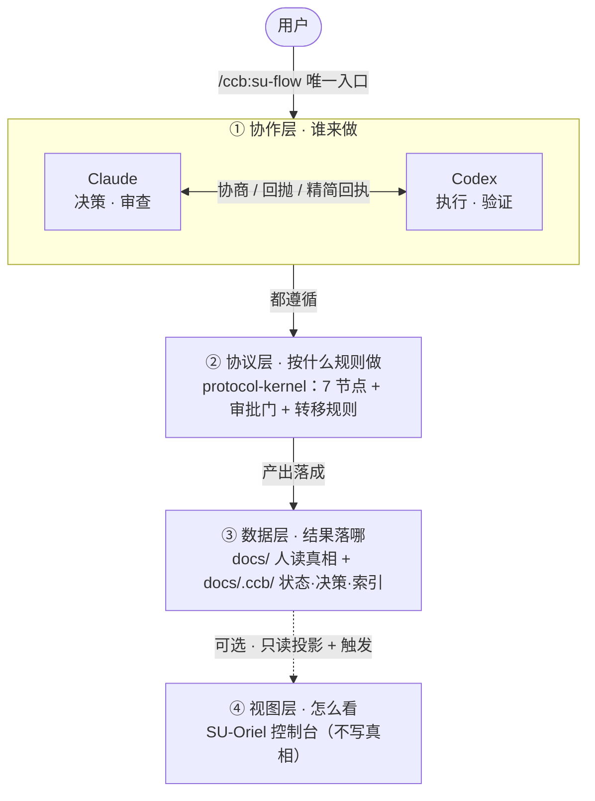

# SU-CCB

> **从 Vibe Coding 到 Vibe Engineering** —— Vibe Coding 解决的是产出速度，Vibe Engineering 解决的是**稳定做对**。

SU-CCB 是一个 **AI 工程协作框架**。它把 AI 协作从"灵感式对话"变成一个**可控、可复用、可审计**的工程过程：
用显式的协议、节点、审批门和归档证据，管理 Claude + Codex 参与的软件工程。

---

## 为什么需要它：Vibe Coding 之后的真问题

AI 已经很会写代码了。但做项目时我们还是经常不放心 —— 问题已经不是 **AI 能不能写**，而是 **AI 能不能持续做对**。

用 AI 写代码的人大多踩过这些坑：

- 写得快，但**方向容易错**；第一轮很好，第二三轮开始跑偏
- **上下文漂移**，改着改着和原始需求脱节
- 返工成本高、Review 成本大
- 很难复盘"**为什么这么改**"

这些表面上是"AI 使用体验问题"，本质上是**工程问题**。而且最贵的环节不是生成 ——

> **不是生成最贵，是"确认"最贵。** 真正烧钱的是：方向走偏后的返工、上下文丢失后的重复沟通、审查时重新理解背景、团队协作时无法复盘。

AI 已经解决了"写得快"，但还没有自动解决"持续做对"。这就是 SU-CCB 要补的那块。

## SU-CCB 解决什么

把原来散落在人脑里的 **Planning / Execution / Review** 显式化，变成可重复、可约束、可审查的流程，落到三件事：

| | 含义 |
|---|---|
| **可控性** | 高风险环节先被管住：关键节点有审批门，避免"正确地执行了错误的目标" |
| **可复用性** | 需求、设计、决策、状态都写成结构化文档落在仓库里，可 diff、可恢复、可沿用 |
| **可审计性** | 每一步都有节点、状态、协商记录和归档证据，谁、为什么、怎么验证，全程可复盘 |

> 工程化的意义不是让过程更重，而是**让高风险环节先被管住**。

## 为什么是 Claude + Codex（决策与执行分工）

关键不是"哪个模型更强"，也不是"agent 越多越好"，而是**职责边界清不清楚**：

| 角色 | 负责 |
|---|---|
| **Claude（决策者）** | 需求理解、技术方案、任务切片、**审查把关** |
| **Codex（执行者）** | 落地实现、执行验证、遇到边界问题**主动回抛**不确定性 |

谁负责想清楚、谁负责做出来、谁负责**在关键节点停下来确认** —— 这是工程角色分层，不是模型 PK。

> 不是 agent 越多越工程化，而是**边界越清晰越工程化**。

## 关键在工作流与协议，不在 prompt / skills

prompt 和 skills 提升的是**能力上限**；工作流与协议解决的是**协作稳定性**。SU-CCB 真正的核心是后者：

- **7 节点工作流**：需求分析 → 技术设计 → 任务拆分 → 派工 → 实施 → 审查 → 归档，每个节点有进入条件、硬约束和完成判定
- **协商（consult）**：方案未稳时先只读协商、不改代码，让 Codex 从执行视角质疑 framing
- **审批门**：关键节点必须确认方向，避免一路做下去才发现前提错了
- **回抛机制**：Codex 遇到边界不硬做，主动把不确定性抛回，而不是做完才发现前提错
- **精简回执**：执行完先给结构化结论（改了什么 / 为什么 / 怎么验证 / 有什么风险），审查者不必从头读 diff

> 没有协议，AI 协作只是高级聊天；**有了协议，AI 协作才开始像工程。** skills 是能力插件，替代不了工作流。

## 完整协作链路

```text
用户提出问题
  → Claude 判断是否需要协商 / 勘探
  → Codex consult（协商）/ explore（勘探现状与风险）
  → Claude 确认方案与任务切片（审批门）
  → Codex execute（实施 + 验证）
  → Codex 输出精简回执
  → Claude review（审查把关）
  → 归档证据（可复盘）
```

面向用户的统一入口是 `/ccb:su-flow`：它按意图在 7 个节点中选择工作模式，把上面这条链路驱动起来。

## 什么时候值得用

**判断标准：只要"方向错一次"的成本很高，就值得工程化。**

| | 典型场景 | 为什么 |
|---|---|---|
| **✅ 值得** | 跨模块改动、接口 / Schema 变更、遗留系统改造、安全 / 性能敏感、多人协作、要审计 | 一旦方向错了，返工 / 损失很贵 —— 花点开销先把方向管住，划算 |
| **❌ 不值得** | 单文件小修、一次性脚本、原型、明确的小 bugfix | 就算做错了，改回来很便宜 —— 上一堆审批门只会拖慢你，不划算 |

SU-CCB 不是把所有任务都变重，而是**把高风险任务管住，把低风险任务保留快速通道**。

---

## 仓库构成（multi-repo）

SU-CCB 由 **4 个各自独立的 git 仓库**协作组成（均在 GitHub `Im-Sue` 组织下）：

> 🔗 **快捷跳转**：[SU-Oriel 控制台](https://github.com/Im-Sue/SU-Oriel) · [su-ccb-claude-plugin](https://github.com/Im-Sue/su-ccb-claude-plugin) · [su-ccb-codex-skills](https://github.com/Im-Sue/su-ccb-codex-skills)

| 仓库 | 角色 |
|---|---|
| [**`Im-Sue/SU-CCB`**](https://github.com/Im-Sue/SU-CCB)（本仓） | 协作中枢：`docs/` 人读文档 + `docs/.ccb/` 工作区（spec / state / decision / index / config）+ 框架文件与跨仓脚本 |
| [**`Im-Sue/SU-Oriel`**](https://github.com/Im-Sue/SU-Oriel) | 可选可视化控制台（web + server），从本地文件 / 数据库投影任务、文档、事件与运行记录 |
| [**`Im-Sue/su-ccb-claude-plugin`**](https://github.com/Im-Sue/su-ccb-claude-plugin) | **协议内核真相源**（`references/kernel/`）+ Claude 侧 skills / 命令 / schema generators |
| [**`Im-Sue/su-ccb-codex-skills`**](https://github.com/Im-Sue/su-ccb-codex-skills) | Codex 侧 execute / consult / doc skills |

**SU-CCB 是根容器**，另外三仓以 **git submodule** 形式嵌套其中（`docs/` 的同级）。submodule 让 SU-CCB
钉住三仓的精确 commit 组合（版本绑定 / 可复现），整套开发者一条 `git clone --recursive` 即可拉齐；
三仓本身仍是各自独立的公开仓，使用者可单独 clone / fork，不需要 SU-CCB。

## 架构

一句话：**用户从一个入口提需求，Claude 和 Codex 在协议约束下分工协作，结果落成可审计的文档，控制台可选地把它画出来。** 分四层看：



| 层 | 做什么 | 在哪个仓 |
|---|---|---|
| **① 协作层** | Claude 决策/审查 ⇄ Codex 执行/验证 | `su-ccb-claude-plugin`（Claude skills）+ `su-ccb-codex-skills`（Codex skills） |
| **② 协议层** | 节点、审批门、转移规则 —— 整套协作的真相源 | `su-ccb-claude-plugin/references/kernel/` |
| **③ 数据层** | spec、状态、决策、索引 —— 业务真相落在人读文档 | 本仓 `SU-CCB`：`docs/` + `docs/.ccb/` |
| **④ 视图层** | 只读投影 + 触发（可选，不写业务真相） | `SU-Oriel`（`su-oriel/`，Fastify + Prisma + React） |

> 真相源在**协议层**（kernel）和**数据层**（docs），控制台只是**可选的一层视图** —— 没有它，整套协作照样靠文件系统、git 和编辑器跑得通。

## 三种使用角色

| 角色 | 怎么用 | 是否需 SU-CCB / 平级 plugin |
|---|---|---|
| **整套开发者**（维护者） | `git clone --recursive` SU-CCB，统一管理、跨仓开发、各仓独立提交、回 SU-CCB 更新指针做版本绑定 | 是（SU-CCB 为根，三仓为 submodule） |
| **只用 plugin / skills** | `/plugin marketplace add` + skill-installer 装进各自 CLI；要改自行 fork | 否（不涉及 SU-CCB / console） |
| **用 SU-Oriel 控制台** | 单独 clone SU-Oriel 运行 + 把 plugin / skills 装进 CLI | 否（控制台经项目本地契约 + 内置 fallback 运行，不要求平级 plugin） |

## 上手

### 整套开发者：一行拉齐（带版本绑定）

SU-CCB 以 submodule 钉住三仓的精确组合，`--recursive` 一次拉全：

```bash
git clone --recursive git@github.com:Im-Sue/SU-CCB.git
# 已 clone 但没拉 submodule：git submodule update --init --recursive
```

各仓自洽，分别构建 / 测试：

```bash
cd SU-CCB
# SU-Oriel 控制台（自洽，无需 sibling）
cd su-oriel && pnpm install && pnpm build && pnpm test && cd ..

# 协议内核 lint
cd su-ccb-claude-plugin && python3 references/kernel/tools/lint_all.py && cd ..

# 四仓凑齐时的跨仓一致性检查（本仓脚本，不进单仓 CI）
bash scripts/check-cross-repo.sh
```

**更新版本绑定**：子仓有新提交后，在 SU-CCB 内登记新组合：

```bash
cd su-ccb-claude-plugin && git pull && cd ..
git add su-ccb-claude-plugin && git commit -m "chore: bump plugin submodule"
```

### 使用者：单独取用

```bash
# 用控制台
git clone git@github.com:Im-Sue/SU-Oriel.git && cd SU-Oriel && pnpm install && pnpm build
# 用 plugin / skills：marketplace / skill-installer；二次开发请自行 fork 对应子仓
```

> SU-Oriel 详细前后端脚本与环境兜底见其仓库内 `README.md`。

### 推进协作流程

面向用户的规划入口统一为 `/ccb:su-flow`（Claude plugin 提供的 thin facade）。决策背景见
[ADR-0010](docs/06_决策记录/ADR-0010-ka10-su-flow-facade-convergence.md)，
plugin 入口见 `su-ccb-claude-plugin/skills/su-flow/SKILL.md`。

## 落地方式（仓库内 dogfooding）

SU-CCB 用自己治理自己：Claude 起草 spec 并在 consult / review 收敛决策，Codex 按 frozen spec 实施并验证，
review 通过后 state 文件记录证据与结论，archive 把 spec 移入 `docs/.ccb/specs/archive/` 留痕，
SU-Oriel 再从 `docs/.ccb/` 与本地 DB 投影成可浏览的运行视图。节点、guard、transition 的真相源以
`su-ccb-claude-plugin/references/kernel/` 为准。

## 关键决策

- CCB 自研 workflow engine；vibeman 及类似产品仅作 reference，不作为运行时依赖。
- **协议内核真相源在 `su-ccb-claude-plugin/references/kernel/`**（plugin sovereignty）。
- Claude plugin 分发 kernel snapshot，下游项目初始化后使用 project-pinned kernel。
- 控制台运行时不要求平级 plugin 目录：契约解析为「显式 env → 项目本地 `docs/.ccb/docs-structure-contract.yaml` → SU-Oriel 内置 fallback」。
- Win32 以 UI-only / dev best-effort 处理，WSL / Linux / macOS 是主要执行面。

## 设计文档

- [系统总览架构](docs/01_架构设计/su-ccb-系统总览架构.md)
- [SU-Oriel 后端架构](docs/01_架构设计/su-oriel-后端架构.md)
- [SU-Oriel 前端架构](docs/01_架构设计/su-oriel-前端架构.md)
- [Claude Plugin 架构](docs/01_架构设计/su-ccb-claude-plugin-架构.md)
- [Codex Skills 架构](docs/01_架构设计/su-ccb-codex-skills-架构.md)
