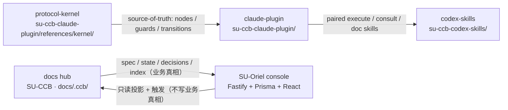

# SU-CCB

SU-CCB 是一个 **AI 工程协作框架**。

它把 Claude、Codex、protocol kernel 与可选控制台放在同一个可审计工作流里，
用结构化 spec、节点状态、review gate 和归档证据来管理 AI 参与的软件工程过程。

## 核心价值

- **把协作流程写成协议**：需求、设计、任务拆分、执行、review、archive 都有节点、状态和 guard。
- **把 AI 分工变成可追踪事实**：Claude 负责协商、决策和审查；Codex 负责执行、验证和精简回执。
- **把项目状态落在仓库里**：`docs/.ccb/` 保存 spec、state、decision 和 index，便于 review、diff 与恢复。
- **把控制台作为可选运行视图**：SU-Oriel 从本地文件和数据库投影任务、文档、事件和运行记录。
- **把分发链路纳入治理**：Claude plugin 与 Codex skills 以 protocol kernel 为源头，保持下游工具一致。

## 适合什么场景

SU-CCB 面向需要长期维护、多人协作、强审计记录的 AI 工程项目。

它不是一个通用聊天机器人外壳，也不是把所有任务自动化到底的脚本集合。它更接近一套
工程协作协议：让 AI agent 可以在明确边界内工作，让人类 reviewer 能看到每一步的证据。

## 仓库构成（multi-repo）

SU-CCB 由 **4 个各自独立的 git 仓库**协作组成（均在 GitHub `Im-Sue` 组织下）：

| 仓库 | 角色 |
|---|---|
| **`Im-Sue/SU-CCB`**（本仓） | 协作中枢：`docs/` 人读文档 + `docs/.ccb/` 工作区（spec / state / decision / index / config）+ 框架文件与跨仓脚本 |
| **`Im-Sue/SU-Oriel`** | 可选可视化控制台（web + server），从本地文件 / 数据库投影任务、文档、事件与运行记录 |
| **`Im-Sue/su-ccb-claude-plugin`** | **协议内核真相源**（`references/kernel/`）+ Claude 侧 skills / 命令 / schema generators |
| **`Im-Sue/su-ccb-codex-skills`** | Codex 侧 execute / consult / doc skills |

**SU-CCB 是根容器**，另外三仓以 **git submodule** 形式嵌套其中（`docs/` 的同级）。submodule 让 SU-CCB
钉住三仓的精确 commit 组合（版本绑定 / 可复现），整套开发者一条 `git clone --recursive` 即可拉齐；
三仓本身仍是各自独立的公开仓，使用者可单独 clone / fork，不需要 SU-CCB。

## 架构



组件说明：

| 组件 | 仓库 / 路径 | 责任 |
|---|---|---|
| protocol-kernel | `su-ccb-claude-plugin/references/kernel/` | 节点 manifest、transition、guard、lint 与协议真相源 |
| claude-plugin | `su-ccb-claude-plugin/` | Claude 侧 skills / 命令、项目初始化、schema generators |
| codex-skills | `su-ccb-codex-skills/` | Codex 侧 execute / consult / doc 能力 |
| SU-Oriel console | `SU-Oriel`（独立仓，目录 `su-oriel/`） | 本地 API、索引、Prisma 数据层、任务投影与管理台 UI |
| docs hub | 本仓 `docs/.ccb/` | 当前项目 CCB 工作区：spec、state、decision、index、config |

## 三种使用角色

| 角色 | 怎么用 | 是否需 SU-CCB / 平级 plugin |
|---|---|---|
| **整套开发者**（维护者） | `git clone --recursive` SU-CCB，统一管理、跨仓开发、各仓独立提交、回 SU-CCB 更新指针做版本绑定 | 是（SU-CCB 为根，三仓为 submodule） |
| **只用 plugin / skills** | `/plugin marketplace add` + skill-installer 装进各自 CLI；要改自行 fork | 否（不涉及 SU-CCB / console） |
| **用 SU-Oriel 控制台** | 单独 clone SU-Oriel 运行 + 把 plugin / skills 装进 CLI | 否（控制台经项目本地契约 + 内置 fallback 运行，不要求平级 plugin） |

## 上手

### 整套开发者：一行拉齐（带版本绑定）

SU-CCB 以 submodule 钉住三仓的精确组合，`--recursive` 一次拉全：

```bash
git clone --recursive git@github.com:Im-Sue/SU-CCB.git
# 已 clone 但没拉 submodule：git submodule update --init --recursive
```

各仓自洽，分别构建 / 测试：

```bash
cd SU-CCB
# SU-Oriel 控制台（自洽，无需 sibling）
cd su-oriel && pnpm install && pnpm build && pnpm test && cd ..

# 协议内核 lint
cd su-ccb-claude-plugin && python3 references/kernel/tools/lint_all.py && cd ..

# 四仓凑齐时的跨仓一致性检查（本仓脚本，不进单仓 CI）
bash scripts/check-cross-repo.sh
```

**更新版本绑定**：子仓有新提交后，在 SU-CCB 内登记新组合：

```bash
cd su-ccb-claude-plugin && git pull && cd ..
git add su-ccb-claude-plugin && git commit -m "chore: bump plugin submodule"
```

### 使用者：单独取用

```bash
# 用控制台
git clone git@github.com:Im-Sue/SU-Oriel.git && cd SU-Oriel && pnpm install && pnpm build
# 用 plugin / skills：marketplace / skill-installer；二次开发请自行 fork 对应子仓
```

> SU-Oriel 详细前后端脚本与环境兜底见其仓库内 `README.md`。

### 推进协作流程

面向用户的规划入口统一为 `/ccb:su-flow`（Claude plugin 提供的 thin facade）。决策背景见
[ADR-0010](docs/06_决策记录/ADR-0010-ka10-su-flow-facade-convergence.md)，
plugin 入口见 `su-ccb-claude-plugin/skills/su-flow/SKILL.md`。

## 协作流程

SU-CCB 采用仓库内 dogfooding 模式推进自身：

1. Claude 起草父需求或任务 spec，并在 consult / review 阶段收敛决策。
2. Codex 按 frozen spec 执行最小充分改动，完成验证并提交。
3. Review 通过后，state 文件记录证据、score 和结论。
4. Archive 阶段把 spec 移入 `docs/.ccb/specs/archive/`，保留历史证据。
5. SU-Oriel 从 `docs/.ccb/` 与本地数据库读取投影，形成可浏览的运行视图。

三条边界：

- 需求决策与最终审批由 Claude 承担。
- 实施、验证和提交由 Codex 承担。
- 节点、guard、transition 以 `su-ccb-claude-plugin/references/kernel/` 为准。

## 关键决策

- CCB 自研 workflow engine；vibeman 及类似产品仅作 reference，不作为运行时依赖。
- **协议内核真相源在 `su-ccb-claude-plugin/references/kernel/`**（plugin sovereignty）。
- Claude plugin 分发 kernel snapshot，下游项目初始化后使用 project-pinned kernel。
- 控制台运行时不要求平级 plugin 目录：契约解析为「显式 env → 项目本地 `docs/.ccb/docs-structure-contract.yaml` → SU-Oriel 内置 fallback」。
- Win32 以 UI-only / dev best-effort 处理，WSL / Linux / macOS 是主要执行面。

## 设计文档

- [CCB 设计总览](docs/01_架构设计/ccb-plan-设计总览架构.md)
- [node kernel northstar](docs/01_架构设计/ccb-plan-node-kernel-northstar架构.md)
- [SU-Oriel 控制台系统架构](docs/01_架构设计/ccb-console-system架构.md)
- [plugin 运行时加载流程](docs/01_架构设计/plugin-运行时加载流程架构.md)
