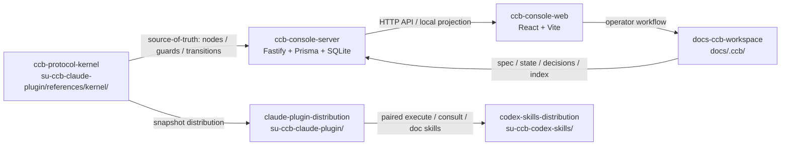

# SU-CCB

SU-CCB 是一个 **AI 工程协作框架**。

它把 Claude、Codex、protocol kernel 与 console 放在同一个可审计工作流里，
用结构化 spec、节点状态、review gate 和归档证据来管理 AI 参与的软件工程过程。

## 核心价值

- **把协作流程写成协议**：需求、设计、任务拆分、执行、review、archive 都有节点、状态和 guard。
- **把 AI 分工变成可追踪事实**：Claude 负责协商、决策和审查；Codex 负责执行、验证和精简回执。
- **把项目状态落在仓库里**：`docs/.ccb/` 保存 spec、state、decision 和 index，便于 review、diff 与恢复。
- **把 console 作为运行视图**：`ccb-console` 从本地文件和数据库投影任务、文档、事件和运行记录。
- **把分发链路纳入治理**：Claude plugin 与 Codex skills 以 protocol kernel 为源头，保持下游工具一致。

## 适合什么场景

SU-CCB 面向需要长期维护、多人协作、强审计记录的 AI 工程项目。

它不是一个通用聊天机器人外壳，也不是把所有任务自动化到底的脚本集合。它更接近一套
工程协作协议：让 AI agent 可以在明确边界内工作，让人类 reviewer 能看到每一步的证据。

典型场景包括：

- 需要把需求从草稿推进到可执行任务的项目。
- 需要 Claude 与 Codex 分角色协作的项目。
- 需要把 AI 产出纳入 code review、state 文件和 git history 的项目。
- 需要把本地工程状态投影到管理台的项目。

## 架构



组件说明：

| 组件 | 路径 | 责任 |
|---|---|---|
| ccb-protocol-kernel | `su-ccb-claude-plugin/references/kernel/` | 节点 manifest、transition、guard、lint 与协议真相源 |
| ccb-console-server | `apps/ccb-console/server/` | 本地 API、索引、Prisma 数据层与任务投影 |
| ccb-console-web | `apps/ccb-console/web/` | 管理台 UI、任务看板、文档中心和运行记录 |
| claude-plugin-distribution | `su-ccb-claude-plugin/` | Claude 侧 thin facade、项目初始化与 kernel snapshot 分发 |
| codex-skills-distribution | `su-ccb-codex-skills/` | Codex 侧 execute / consult / doc 能力分发 |

## 仓库布局

| 路径 | 内容 |
|---|---|
| `su-ccb-claude-plugin/references/kernel/` | CCB 协议内核，包含节点 manifest、lint 工具和 guard 定义 |
| `docs/.ccb/` | 当前项目的 CCB 工作区：spec、state、decision、index、config |
| `apps/ccb-console/` | Console 前后端与开发脚本 |
| `su-ccb-claude-plugin/` | Claude plugin 下游分发目录 |
| `su-ccb-codex-skills/` | Codex skills 下游分发目录 |
| `docs/01_架构设计/` | 架构设计、北极星、路线图 gap analysis |
| `docs/05_经验沉淀/` | 经验沉淀、评估报告和案例素材 |

## 上手

当前主仓的最小上手路径是命令行 quickstart；console 可作为后续运行视图。

1. **确认环境**

   本仓使用 Node.js、pnpm workspace、TypeScript、React、Fastify、Prisma 和 SQLite。
   先按 [docs/requirements.md](docs/requirements.md) 确认 6 项依赖；根目录
   `package.json` 指定 pnpm 版本，建议优先通过 corepack 管理 pnpm。

2. **跑通 quickstart**

   按 [docs/quickstart.md](docs/quickstart.md) 走一次 5-10 分钟自身文档修复流程，
   完成 spec → review → execute → archive 的最小闭环。

   v0.4 v1 起，面向用户的规划入口统一为 `/ccb:su-flow`。它是
   SingleTaskScheduler 的公开 thin facade；决策背景见
   [ADR-0010](docs/.ccb/decisions/ADR-0010-ka10-su-flow-facade-convergence.md)，
   Claude plugin 入口见
   [su-flow SKILL.md](su-ccb-claude-plugin/skills/su-flow/SKILL.md)。

3. **验证仓库状态**

   在主仓根目录运行已有验证命令：

   ```bash
   pnpm test
   pnpm build
   python3 su-ccb-claude-plugin/references/kernel/tools/lint_all.py --legacy-baseline
   ```

   `lint_all.py --legacy-baseline` 会保持 cutoff 后新 spec 严格校验，同时把已登记的
   legacy archive spec 降级为 baseline warning。需要启动本地 console 时，再进入
   [apps/ccb-console/README.md](apps/ccb-console/README.md) 查看前后端脚本和环境兜底。

## 协作流程

SU-CCB 当前采用仓库内 dogfooding 模式推进自身：

1. Claude 起草父需求或任务 spec，并在 consult / review 阶段收敛决策。
2. Codex 按 frozen spec 执行最小充分改动，完成验证并提交。
3. Review 通过后，state 文件记录证据、score 和结论。
4. Archive 阶段把 spec 移入 `docs/.ccb/specs/archive/`，保留历史证据。
5. Console 从 `docs/.ccb/` 与本地数据库读取投影，形成可浏览的运行视图。

这个流程强调三条边界：

- 需求决策与最终审批由 Claude 承担。
- 实施、验证和提交由 Codex 承担。
- 节点、guard、transition 以 `su-ccb-claude-plugin/references/kernel/` 为准。

## 当前状态

当前仓库已经完成 v0.3.x 到 v6 兼容升级的一轮 dogfooding，并启动
v0.4 / Console V2 / growth 的 master roadmap。

近期已完成的基础能力包括：

- `docs/.ccb/index/` 四份索引重建。
- 旧 archive spec 的 legacy allowlist baseline。
- Console Phase 0-5 的本地 smoke 验证和环境兜底修复。
- G1-G4 task 的 review、state 与 archive 闭环。

## 设计文档

- [CCB 设计总览](docs/01_架构设计/ccb-plan/00-设计总览.md)
- [v0.4 node kernel northstar](docs/01_架构设计/ccb-plan/v0.4-node-kernel-northstar.md)
- [master roadmap gap analysis](docs/01_架构设计/ccb-plan/2026-05-02-master-roadmap-gap-analysis.md)
- [ccb-console system architecture](docs/01_架构设计/ccb-console/2026-04-14-ccb-console-system-architecture.md)
- [评估报告](docs/05_经验沉淀/ccb-plan/评估报告.md)

## 归档案例

- [v6 compatibility upgrade](docs/.ccb/specs/archive/2026-04-30-ccb-v6-compat-upgrade.md)
- [console environment follow-up](docs/.ccb/specs/archive/2026-05-01-ccb-v6-console-env-followup.md)
- [G4 web test AbortSignal fix](docs/.ccb/specs/archive/2026-05-01-g4-t1-web-test-abortsignal-fix.md)
- [G4 node-pty postinstall rebuild](docs/.ccb/specs/archive/2026-05-01-g4-t2-node-pty-postinstall-rebuild.md)
- [G4 pnpm corepack troubleshoot doc](docs/.ccb/specs/archive/2026-05-01-g4-t3-pnpm-corepack-troubleshoot-doc.md)

## 关键决策

- CCB 自研 workflow engine；vibeman 及类似产品仅作 reference，不作为运行时依赖。
- `su-ccb-claude-plugin/references/kernel/` 是主仓协议内核 source-of-truth。
- Claude plugin 分发 kernel snapshot，下游项目初始化后使用 project-pinned kernel。
- Win32 以 UI-only / dev best-effort 处理，WSL / Linux / macOS 是主要执行面。

## 开发者入口

- Console 开发与 troubleshooting：见 [apps/ccb-console/README.md](apps/ccb-console/README.md)
- 当前项目事实索引：见 [docs/.ccb/index/project.yaml](docs/.ccb/index/project.yaml)
- 架构索引：见 [docs/.ccb/index/architecture.yaml](docs/.ccb/index/architecture.yaml)
- 决策索引：见 [docs/.ccb/index/decisions.yaml](docs/.ccb/index/decisions.yaml)

## 版本与路线

本 README 只描述当前主仓入口和已存在文档。更完整的推广材料、英文版 README、
CONTRIBUTING、ROADMAP、issue templates 与外部案例包将在后续 E3 task 中拆分完成。
