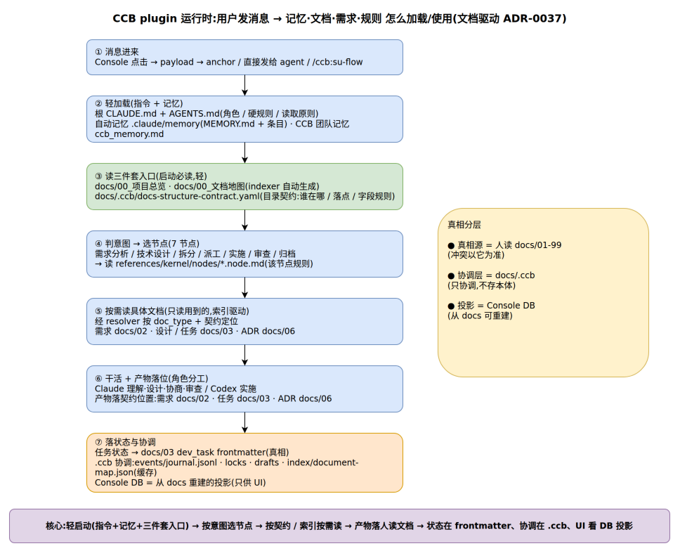

# Plugin 运行时加载流程架构

> 一句话定位:用户发一条消息后,CCB plugin 怎么加载/使用记忆·文档·需求·规则(文档驱动架构 ADR-0037 现状) ｜ 最后更新: 2026-05-28 ｜ 常青文档

## 一、流程图

## 二、主流程(7 步)

| 步 | 做什么 | 关键读取 / 产物 |
|----|--------|----------------|
| ① 消息进来 | Console 点击→payload→anchor / 直接发给 agent / `/ccb:su-flow` | — |
| ② 轻加载(指令+记忆) | 加载角色、硬规则、跨会话记忆 | 根 `CLAUDE.md`+`AGENTS.md`、自动记忆 `.claude/memory`、CCB 团队记忆 `ccb_memory.md` |
| ③ 读三件套入口(启动必读,轻) | 拿项目全貌 + 文档清单 + 目录契约 | `docs/00_项目总览`、`docs/00_文档地图`(indexer 生成)、`docs/.ccb/docs-structure-contract.yaml` |
| ④ 判意图 → 选节点 | 7 节点(需求分析/技术设计/拆分/派工/实施/审查/归档)选一个,读该节点规则 | `references/kernel/nodes/*.node.md` |
| ⑤ 按需读具体文档 | 经 resolver 按 `doc_type` + 契约定位,只读用到的 | 需求 `docs/02`、设计/任务 `docs/03`、ADR `docs/06` |
| ⑥ 干活 + 产物落位 | Claude 理解·设计·协商·审查;Codex 实施 | 产物落契约位置:`docs/02`·`docs/03`·`docs/06` |
| ⑦ 落状态与协调 | 状态进文档、协调进 `.ccb`、UI 看投影 | 任务状态→`docs/03` dev_task frontmatter;`.ccb` events/locks/drafts/index;Console DB = 投影 |

## 三、真相分层

- **真相源** = 人读 `docs/01-99`(冲突以它为准)
- **协调层** = `docs/.ccb`(只协调,不存本体:events / locks / drafts / index / schemas / config)
- **投影** = Console DB(从 docs 可重建)

## 四、核心

轻启动(指令 + 记忆 + 三件套入口) → 按意图选节点 → 按契约 / 索引按需读 → 产物落人读文档 → 状态在 frontmatter、协调在 `.ccb`、UI 看 DB 投影。

## 五、相关文档

| 想深入 | 看 |
|--------|-----|
| 为什么真相上移到人读文档 | `docs/06_决策记录/ADR-0037-文档驱动架构-真相源上移人读文档.md` |
| 文档驱动技术设计 | `docs/03_开发计划/docs治理-文档驱动架构-技术设计.md` |
| 目录契约(谁在哪 / 落点 / 字段规则) | `docs/.ccb/docs-structure-contract.yaml` |

## 变更记录

| 日期 | 版本 | 变更 |
|------|------|------|
| 2026-05-28 | v1.0 | 初版:沉淀文档驱动(ADR-0037)运行时加载/使用流程图 |
